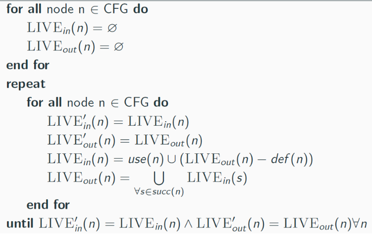
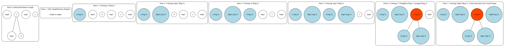

# Compiler Project

## Ollir Code
### Varargs Optimization
To improve the handling of varargs during OLLIR code generation, we introduced an optimization step **VarargOpt** before the generation phase. This step consistently converts method call arguments into an array, allowing us to leverage the array visit logic directly. With this change, we avoid duplicating logic across different areas and ensure a cleaner implementation.

### Tests
We added additional tests to more thoroughly validate the OLLIR code generation, with a particular focus on method calls, which were a challenging aspect. We also made extensive use of the launcher to observe the output for specific inputs, which helped guide and verify the OLLIR code generation
## Optimizations

## Constant Propagation 

In order to test the correctness of this optimization, 6 extra tests were created. These tests target the components of our language that impact control flow, since this is the hardest part to get right in constant propagation. 

## Register Allocation

### Local Register

Here follows our approach for the optimization:

We compute, **for each method** the liveness, followed by, the Interference Graph, finished by applying a graph coloring algorithm. 

So, for the **Liveness analysis**, we need to calculate the variables that are susceptible of being used/read later on the program, before being assigned a new value.

The way we tackled this challenge, was by analysing **backwards**, from the end of the method towards the beginning, each instruction within the CFG, having calculated two key sets of variables: **LIVE_in**, representing variables live immediately before the instruction executes, and **LIVE_out**, representing variables live immediately after it executes.
To manage this information, we map each instruction with its **ID** serving as the key to a list of the instruction's variable names.

Our analysis has two main phases.

The initialization phase iterates through all instructions to pre-calculate the **use** and **def** information for each one by examining their types and operands. At the same time, the ``in`` and ``out`` sets associated with every instruction are initialized to be empty.

Following initialization, the core iterative calculation begins.
It mirrors the behaviour of the given pseudocode.



Having calculated the ``in`` and ``out`` sets, we will now compute the ``Interference Graph``.

The main purpose of the class is to:

- Identify local variables within a method.
- Determine the "liveliness range" for each local variable (the set of instructions where the variable is in use).
- Create a graph where:
    - **Nodes** represent the local variables.
    - **Edges** connect nodes (variables) that are live at the same time, indicating they "interfere" and need different registers.


**Table Formation** 

The process of "table formation" within the `InterferenceGraph` specifically refers to building a map that holds the graph's nodes. This map (`nodes`) is crucial because it organizes the nodes (which represent variables) and allows quick access using a variable's unique identifier: its virtual register number.

This map is formed by the `getGraphNodes()` method, which performs the following steps:

1. It starts with the complete variable table of the method (`varTable`).
2. It iterates through every variable in this table.
3. For each variable, it checks if the variable is a local variable (its scope is `LOCAL`).
4. Non-local variables (like parameters or fields) are skipped.
5. For each local variable found:
    - A graph `Node` is created for it. (This step implicitly involves using the provided liveliness information to determine the variable's live range, which is stored in the `Node`).
    - This new `Node` is added to a map, using the local variable's virtual register number as the key.

The resulting map is the "table" of graph nodes, containing only the local variables relevant to the interference graph, indexed by their registers.

**Liveliness Table Example**

This code has a similar behaviour to this example.

Here is a simple code snippet and its corresponding liveliness table.

**Simple Code Snippet**

Let's consider this snippet of code:

```java
class RegAllocTest {
    public int methodWithParams(int a, int b) {
        int c;
        int d;
        int e;

        c = a + b;
        d = c * 2;
        e = d - c;

        return e;
    }
}
```

**Liveliness Table**

| Inst. ID | Conceptual Operation (based on IN/OUT and code)        | Variables Live IN | Variables Live OUT |
|----------|---------------------------------------------------------|-------------------|--------------------|
| 1        | Preparing to compute a + b                             | {a, b}            | {tmp0}             |
| 2        | Storing result of a + b into c                         | {tmp0}            | {c}                |
| 3        | Preparing to compute c * 2                             | {c}               | {c, tmp1}          |
| 4        | Storing result of c * 2 into d                         | {c, tmp1}         | {c, d}             |
| 5        | Preparing to compute d - c                             | {c, d}            | {tmp2}             |
| 6        | Storing result of d - c into e                         | {tmp2}            | {e}                |
| 7        | Returning e                                            | {e}               | {}                 |

---

**Consequences (Interference)**

Interference occurs when two or more variables are live at the same point in the program, meaning they cannot be assigned to the same physical register. We determine interference by looking at the sets of variables live before (IN) and after (OUT) each instruction.

**Examining the 'Variables Live IN' and 'Variables Live OUT' columns**:

- **Before Instruction 1 (IN):** `{a, b}`. Variables a and b are live together. → **a and b interfere**.
- **After Instruction 1 (OUT):** `{tmp0}`. No interference.
- **Before Instruction 2 (IN):** `{tmp0}`. No interference.
- **After Instruction 2 (OUT):** `{c}`. No interference.
- **Before Instruction 3 (IN):** `{c}`. No interference.
- **After Instruction 3 (OUT):** `{c, tmp1}`. Variables c and tmp1 are live together. → **c and tmp1 interfere**.
- **Before Instruction 4 (IN):** `{c, tmp1}`. Variables c and tmp1 are live together. → **c and tmp1 interfere**.
- **After Instruction 4 (OUT):** `{c, d}`. Variables c and d are live together. → **c and d interfere**.
- **Before Instruction 5 (IN):** `{c, d}`. Variables c and d are live together. → **c and d interfere**.
- **After Instruction 5 (OUT):** `{tmp2}`. No interference.
- **Before Instruction 6 (IN):** `{tmp2}`. No interference.
- **After Instruction 6 (OUT):** `{e}`. No interference.
- **Before Instruction 7 (IN):** `{e}`. No interference.
- **After Instruction 7 (OUT):** `{}`. No interference.


**Summary of Interference Based on the Liveliness Table**

Based on the provided IN and OUT set data and the constructed table:

- **Variable a interferes with variable b.**
- **Variable c interferes with variable tmp1.**
- **Variable c interferes with variable d.**


Finally, we just need to correctly color the graph.

Using the previous code we have seen, we should get something like this when coloring the graph:




